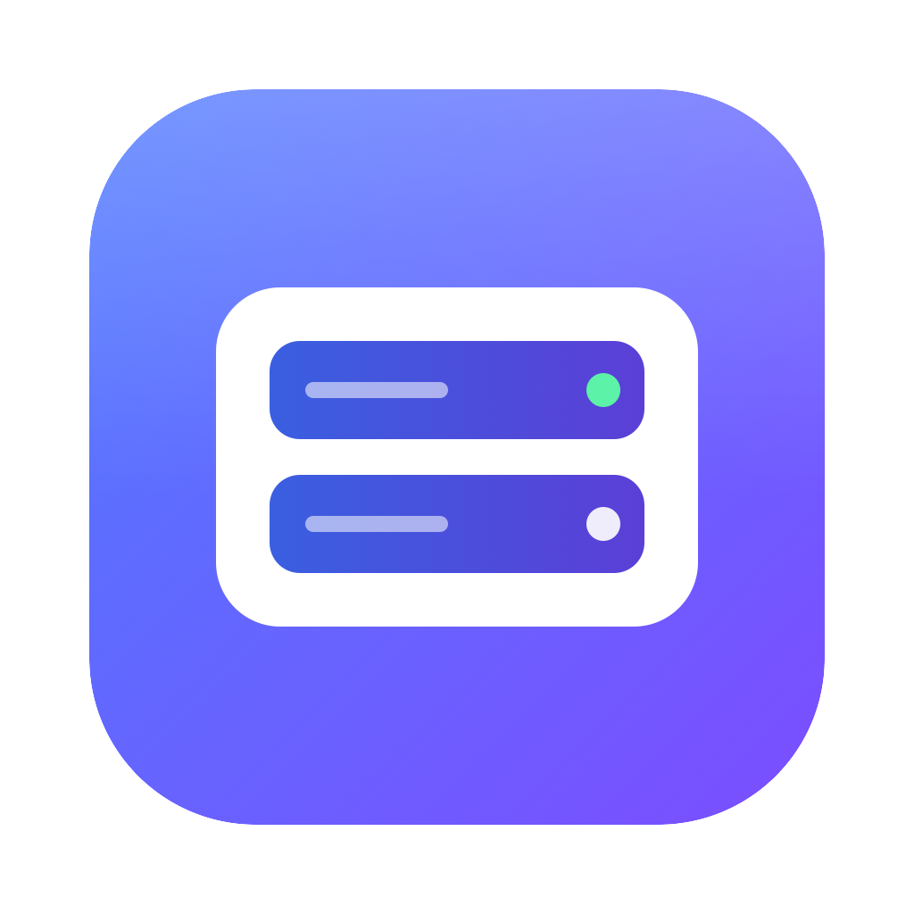
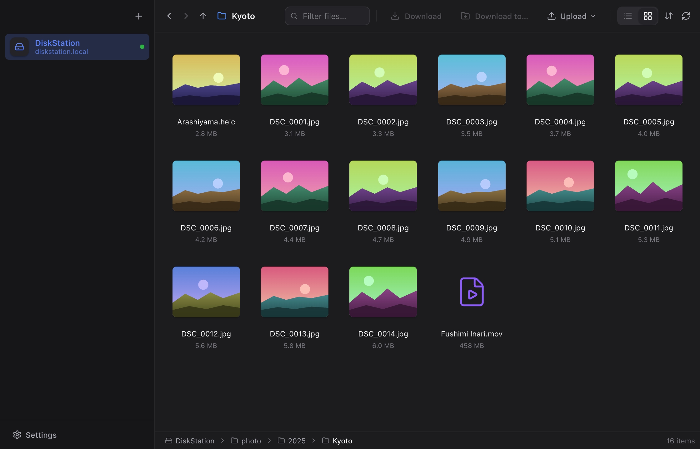

# Neat NAS

**Remember your NAS once. Open it forever.**

The lightest NAS file browser for Mac and Windows. 
Save the address, user name and password a single time. From then on, every launch opens straight into your files.

[**Download for macOS**](https://github.com/jason-jm/neat-nas/releases/latest) · [**Download for Windows**](https://github.com/jason-jm/neat-nas/releases/latest) · [Website](https://jason-jm.github.io/neat-nas/)

[English](README.md) · [简体中文](docs/i18n/README.zh-CN.md) · [繁體中文](docs/i18n/README.zh-TW.md) · [日本語](docs/i18n/README.ja.md) · [한국어](docs/i18n/README.ko.md) · [Deutsch](docs/i18n/README.de.md) · [Español](docs/i18n/README.es.md) · [Français](docs/i18n/README.fr.md) · [Português](docs/i18n/README.pt-BR.md) · [Русский](docs/i18n/README.ru.md)

 

---

## The problem

Everyone with a NAS knows the drill. You want one file, so you open Finder or Explorer, hunt for the server, try to recall whether it was `192.168.1.126` or `.128`, type the user name, get the password wrong, wait for the mount, and finally start browsing. Every. Single. Time.

## The fix

Neat NAS is a small desktop app that does one thing well: it opens on your NAS. Add it once, and from then on the app launches directly into your files, connected, with the password fetched from the system keychain. No mounting, no drive letters, no `smb://` to type ever again.

## What you get

- **Opens straight into your files.** The last NAS you used is connected before the window finishes fading in.
- **Finds your NAS by itself.** Synology, QNAP, TrueNAS, a Raspberry Pi with Samba: anything that announces SMB on the network shows up in the add dialog.
- **Passwords stay in the keychain.** macOS Keychain and Windows Credential Manager, never a plain-text file.
- **Quick Look for everything.** Photos, video, audio, PDF and text stream straight from the NAS. Press Space, like Finder.
- **Move files both ways.** Download and upload files or whole folders, drag files out into Finder, drop files in to upload.
- **Transfers that survive.** Interrupted or paused transfers resume where they stopped, even after you quit the app.
- **Photo grids that load instantly.** Thumbnails use the previews cameras embed in every photo, so a folder of RAW or HEIC files needs only the file headers.
- **Light and dark, ten languages.** English, 简体中文, 繁體中文, 日本語, 한국어, Deutsch, Español, Français, Português, Русский.
- **Genuinely light.** A native Rust core and the system web view: about 10 MB to download, instant to launch, no Electron.
- **Updates itself.** New versions show up in Settings and install in one click, verified with a signature.

## Install

**macOS 11+** (Apple Silicon and Intel, one universal build): open the `.dmg` and drag Neat NAS to Applications. It is signed with a Developer ID and notarized by Apple, so it opens like any other app you download.

**Windows 10/11**: run the `-setup.exe`. It installs for the current user, no admin rights needed. Until the installer is code-signed, SmartScreen shows "Windows protected your PC" → More info → Run anyway.

**No installer?** Every release also has a `-mac.zip` and a `-win.zip` with the same app: unzip and run it (on a Mac, move it to Applications first). The Windows zip relies on the WebView2 runtime that Windows 11 and up-to-date Windows 10 include; the installer adds it when it is missing. `SHA256SUMS.txt` lists the checksums of all four files.

Everything is on the [releases page](https://github.com/jason-jm/neat-nas/releases/latest).

## How it works

Neat NAS speaks SMB 2 and 3 itself, through a pure-Rust client, so nothing is mounted and nothing needs admin rights. Listing a folder with hundreds of entries takes tens of milliseconds on a home network. Previews are served to the built-in viewer over an internal `nasfile://` protocol with range requests, which is why a video starts playing without downloading first.

The UI is React inside the operating system's own web view (WebKit on macOS, WebView2 on Windows) via [Tauri 2](https://tauri.app), which keeps the download an order of magnitude smaller than an Electron app.

## Contributing

Bug reports, translations and pull requests are welcome. Start with [docs/DEVELOPING.md](docs/DEVELOPING.md): it covers the throw-away local Samba server used for tests, the dev hooks, and the code layout. Releases are described in [RELEASE.md](RELEASE.md).

## License

[MIT](LICENSE). Made for people who would rather browse their NAS than remember it.

How releases are built and signed, and what the app sends over the network: [code signing policy](docs/code-signing-policy.md).
