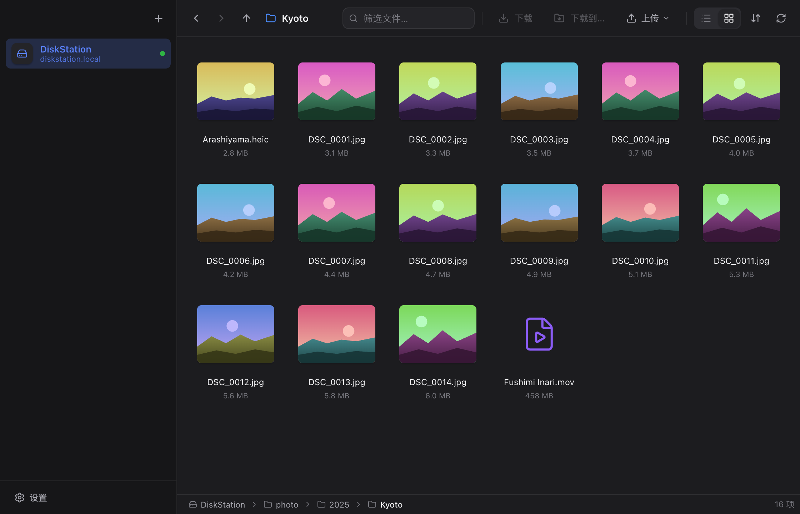

# Neat NAS

**NAS 的地址、账号、密码，只记一次。**

Mac 和 Windows 上最轻量的 NAS 文件浏览器。地址、用户名、密码保存一次，之后每次打开应用，直接就是你的文件。

[**下载 macOS 版**](https://github.com/jason-jm/neat-nas/releases/latest) · [**下载 Windows 版**](https://github.com/jason-jm/neat-nas/releases/latest) · [官网](https://jason-jm.github.io/neat-nas/)

[English](../../README.md) · [简体中文](README.zh-CN.md) · [繁體中文](README.zh-TW.md) · [日本語](README.ja.md) · [한국어](README.ko.md) · [Deutsch](README.de.md) · [Español](README.es.md) · [Français](README.fr.md) · [Português](README.pt-BR.md) · [Русский](README.ru.md)

 

---

## 问题

有 NAS 的人都懂：想拿一个文件，先打开 Finder 或资源管理器，找到服务器，回忆到底是 `192.168.1.126` 还是 `.128`，输用户名，密码打错一次，等挂载，最后才能开始翻文件。每一次都是这样。

## 解法

Neat NAS 是一个只做好一件事的小应用：打开就是你的 NAS。添加一次之后，每次启动都直接进入文件列表，已连接，密码从系统钥匙串里自动取出。不挂载，没有盘符，再也不用输 `smb://`。

## 你能得到什么

- **打开即文件。** 上次用的 NAS 在窗口显示完之前已经连上。
- **自动发现 NAS。** 群晖、威联通、TrueNAS、跑着 Samba 的树莓派，只要在局域网里广播 SMB，添加对话框里就能看到。
- **密码只放在钥匙串。** macOS 钥匙串和 Windows 凭据管理器，绝不落到明文文件。
- **任何文件都能快速预览。** 照片、视频、音频、PDF、文本直接从 NAS 流式播放，像 Finder 一样按空格。
- **双向传文件。** 下载、上传文件或整个文件夹；拖出到 Finder，拖进来即上传。
- **传输不怕中断。** 暂停或中断的传输从断点继续，退出应用再打开也一样。
- **秒开的照片网格。** 缩略图使用相机内嵌在每张照片里的预览，RAW 和 HEIC 文件夹只需读文件头。
- **浅色、深色，十种语言。**
- **真正轻量。** 纯 Rust 内核加系统自带 WebView，下载约 10 MB，秒开，没有 Electron。
- **自动更新。** 新版本出现在设置里，一键安装，安装前验证签名。

## 安装

**macOS 11 及以上**（Apple 芯片和 Intel 通用）：打开 `.dmg`，把 Neat NAS 拖到"应用程序"。应用已用开发者证书签名并通过 Apple 公证，像其他下载的应用一样直接打开即可。

**Windows 10/11**：运行 `-setup.exe`，安装到当前用户，不需要管理员权限。安装器暂未签名，SmartScreen 会提示"Windows 已保护你的电脑"→ 更多信息 → 仍要运行。

安装包在 [Releases 页面](https://github.com/jason-jm/neat-nas/releases/latest)。

## 工作原理

Neat NAS 用纯 Rust 客户端直接实现 SMB 2/3，不挂载任何东西，也不需要管理员权限。家庭局域网内列出几百个文件只要几十毫秒。预览通过内部的 `nasfile://` 协议按范围读取，所以视频不用先下载就能播放。界面是运行在系统自带 WebView（macOS 的 WebKit、Windows 的 WebView2）里的 React，由 [Tauri 2](https://tauri.app) 驱动，体积比 Electron 应用小一个数量级。

## 参与

欢迎提交问题、翻译和 PR。从 [docs/DEVELOPING.md](../DEVELOPING.md) 开始，里面有用于测试的本地 Samba、开发钩子和代码结构。

## License

[MIT](../../LICENSE)
